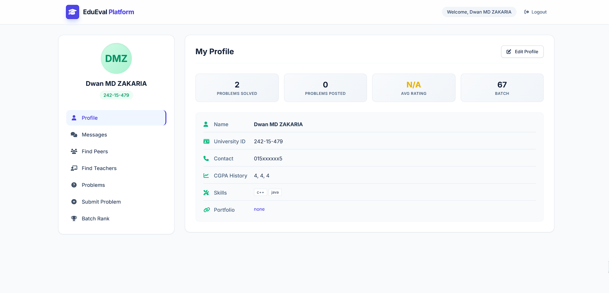

# Student Evaluation Platform

A web-based platform designed to facilitate interaction between students and teachers. It allows users to register as students or teachers, submit academic problems, propose solutions, chat in real-time, view leaderboards, and manage profiles. The application leverages Firebase for backend services, providing offline persistence and real-time data synchronization.



## Features

- **User Authentication**: Secure registration and login for students and teachers (plain-text password storage – for demo/educational use only).
- **Dashboards**: Personalized dashboards for students and teachers with profile management.
- **Problem Submission & Solving**: Users can submit problems, propose solutions, accept/reject them, and track solved problems for leaderboard rankings.
- **Real-Time Chat**: In-app messaging with conversation history.
- **Search Functionality**: Search peers by University ID or teachers by name.
- **Leaderboards**: Batch-wise leaderboard for students based on problems solved.
- **Offline Support**: Firebase IndexedDB persistence with automatic syncing and connection status indicator.
- **Responsive Design**: Mobile-friendly UI built with Tailwind CSS.

## Technologies Used

- **Frontend**: HTML5, Tailwind CSS, Font Awesome, vanilla JavaScript (ES6 modules)
- **Backend/Database**: Firebase Firestore (real-time database with offline persistence)
- **Deployment**: Static site ready for Netlify (or any static host)
- **Local Development**: Simple Python HTTP server with no-cache headers

## Prerequisites

- A modern web browser
- Python 3 (for local development server)
- Firebase project with Firestore enabled

**Important Security Note**  
The `firebase-config.js` file contains hardcoded Firebase configuration (including API key). This is acceptable for client-side Firebase usage as keys are meant to be public, but **never enable Firebase Security Rules that allow unrestricted access in production**. Always secure your Firestore with proper rules.

## Setup

1. Clone the repository:
   ```bash
   git clone https://github.com/your-username/student-evaluation-platform.git
   cd student-evaluation-platform
   ```
2. Configure Firebase:
   - Go to [Firebase Console](https://console.firebase.google.com/)
   - Create a new project
   - Enable Firestore in production mode
   - Replace the content of `firebase-config.js` with your project's config
   - Create the following collections in Firestore:  
     `teachers`, `students`, `problems`, `extracare`, `messages`

3. Run locally:
   ```bash
   python server.py
   ```
Open http://localhost:5000 in your browser.

## Deployment

### Netlify (Recommended)

1. Push your repo to GitHub
2. Connect the repository in Netlify
3. No build command needed (static site)
4. Publish directory: `.` (root)
5. Netlify will use `netlify.toml` for security headers and `_redirects` for SPA routing

### Other Static Hosts

- GitHub Pages, Vercel, Cloudflare Pages, etc.
- Ensure SPA fallback is configured (`/* -> /index.html`)

## File Structure

- `index.html` – Main page and UI
- `app.js` – Application logic, authentication, rendering
- `firebase-config.js` – Firebase initialization and helpers
- `styles.css` – Custom styles (extends Tailwind)
- `netlify.toml` – Netlify configuration
- `_redirects` – SPA routing rules
- `server.py` – Local development server

## Contributing

Contributions are welcome! Feel free to:

- Open issues for bugs or feature requests
- Submit pull requests with improvements
- Improve UI/UX, add new features, or enhance security

## License

MIT License – feel free to use, modify, and distribute.

## Acknowledgments

- Powered by [Firebase](https://firebase.google.com/)
- Styled with [Tailwind CSS](https://tailwindcss.com/)
- Icons from [Font Awesome](https://fontawesome.com/)

---
Made for educational collaboration